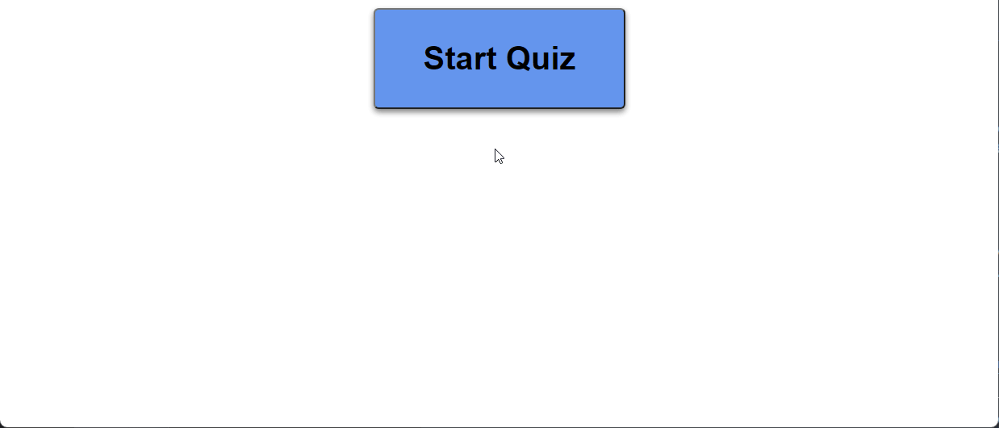

## JS FUNDAMENTALS QUIZ GAME

## Technology Used 

| Technology Used         | Resource URL           | 
| ------------- |:-------------:| 
| HTML    | [https://developer.mozilla.org/en-US/docs/Web/HTML](https://developer.mozilla.org/en-US/docs/Web/HTML) | 
| CSS     | [https://developer.mozilla.org/en-US/docs/Web/CSS](https://developer.mozilla.org/en-US/docs/Web/CSS)      |   
| Git | [https://git-scm.com/](https://git-scm.com/)     |    
| JavaScript | [https://www.javascript.com/](https://www.javascript.com/)     |   

## Description 

[Visit the Deployed Site](https://makeitouthill.github.io/Code-JS-Quiz/)

Javascript fundemental coding game was the intention with this application. Currently users can click start and see first question prompt and sumbit a answer. This quiz game would deduct time for each question wrong and keep score of user's highscore.

## Usage 

1. Visting site URL
2.Click Start Quiz button
3. Answer the multiple choice prompt
4. Click Submit

## Learning Points 

    Through building this application I learned about innerHTML function
    this allows me to have updating html after events are triggered.

## Credits

### Alex Horning

* [Github](https://github.com/makeitouthill/)

## License
    None

---
